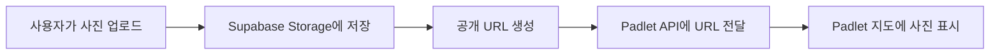

# 📸 Supabase Storage 설정 가이드

CSS Art Map 프로젝트에서 사진 업로드 기능을 사용하기 위한 Supabase 설정 가이드입니다.

## 🚀 빠른 설정 (5분 소요)

### 1단계: Supabase 계정 생성

1. [https://supabase.com](https://supabase.com) 접속
2. **"Start your project"** 클릭
3. GitHub 계정으로 로그인 (또는 이메일로 가입)

### 2단계: 새 프로젝트 생성

1. **"New Project"** 클릭
2. 프로젝트 정보 입력:
   - **Name**: `css-art-map` (원하는 이름)
   - **Database Password**: 강력한 비밀번호 생성 (자동 생성 버튼 사용 권장)
   - **Region**: `Northeast Asia (Seoul)` 선택 (한국에서 가장 빠름)
   - **Pricing Plan**: Free tier (무료)

3. **"Create new project"** 클릭
4. 프로젝트 생성 완료까지 약 2분 대기

### 3단계: Storage 버킷 생성

1. 왼쪽 사이드바에서 **"Storage"** 클릭
2. **"Create a new bucket"** 클릭
3. 버킷 설정:
   ```
   Name: gallery-photos
   Public bucket: ✅ 체크 (공개 접근 허용)
   File size limit: 50MB (기본값)
   Allowed MIME types: image/* (이미지만 허용)
   ```
4. **"Create bucket"** 클릭

### 4단계: Storage 정책 설정 (보안)

1. `gallery-photos` 버킷 클릭
2. **"Policies"** 탭 클릭
3. **"New Policy"** 클릭
4. **"For full customization"** 선택
5. 다음 정책들 추가:

#### 📖 읽기 정책 (누구나 사진 볼 수 있도록)
```sql
-- Policy name: Public Read Access
-- Allowed operation: SELECT

true  -- 모든 사용자가 읽기 가능
```

#### ✍️ 쓰기 정책 (누구나 업로드 가능하도록)
```sql
-- Policy name: Public Insert Access  
-- Allowed operation: INSERT

true  -- 모든 사용자가 업로드 가능
```

> **보안 참고**: 프로덕션 환경에서는 인증된 사용자만 업로드하도록 정책을 수정하세요.

### 5단계: API 키 가져오기

1. 왼쪽 사이드바에서 **"Settings"** (⚙️) 클릭
2. **"API"** 섹션 클릭
3. 다음 두 값을 복사:
   - **Project URL**: `https://xxxxxxxxxxxxx.supabase.co`
   - **anon public key**: `eyJhbGciOiJIUzI1NiIsInR5cCI6IkpXVCJ9...` (매우 긴 문자열)

### 6단계: Streamlit Cloud에 설정 추가

#### 옵션 A: Streamlit Cloud 대시보드에서 설정
1. [share.streamlit.io](https://share.streamlit.io) 접속
2. 배포된 앱 선택
3. **"Settings"** → **"Secrets"** 클릭
4. 다음 내용 추가:
```toml
SUPABASE_URL = "https://xxxxxxxxxxxxx.supabase.co"
SUPABASE_ANON_KEY = "eyJhbGciOiJIUzI1NiIsInR5cCI6IkpXVCJ9..."
```
5. **"Save"** 클릭

#### 옵션 B: 로컬 테스트용 (.streamlit/secrets.toml)
```toml
# .streamlit/secrets.toml
SUPABASE_URL = "https://xxxxxxxxxxxxx.supabase.co"
SUPABASE_ANON_KEY = "eyJhbGciOiJIUzI1NiIsInR5cCI6IkpXVCJ9..."
PADLET_API_KEY = "pdltp_your_padlet_key"
```

## ✅ 설정 확인

1. Streamlit 앱 새로고침
2. "직접 작성" 탭에서 사진 업로드 테스트
3. 성공 메시지 확인: "📤 사진이 클라우드에 업로드되어 Padlet에 공유됩니다"

## 🎯 작동 방식



## 💰 무료 한도

Supabase Free Tier 제공 사항:
- ✅ **Storage**: 1GB
- ✅ **대역폭**: 월 2GB
- ✅ **파일 업로드**: 월 50,000개
- ✅ **API 요청**: 무제한
- ✅ **프로젝트 수**: 2개

CSS Art Map 용도로는 충분합니다!

## 🔒 보안 권장사항

### 프로덕션 환경에서:

1. **업로드 크기 제한**:
   ```python
   # supabase_storage.py에 추가
   MAX_FILE_SIZE = 10 * 1024 * 1024  # 10MB
   if uploaded_file.size > MAX_FILE_SIZE:
       st.error("파일이 너무 큽니다 (최대 10MB)")
   ```

2. **파일 타입 검증**:
   ```python
   ALLOWED_TYPES = ['image/jpeg', 'image/png', 'image/jpg']
   if uploaded_file.type not in ALLOWED_TYPES:
       st.error("JPG, PNG 파일만 업로드 가능합니다")
   ```

3. **Rate Limiting** (선택사항):
   - Supabase Dashboard → Authentication → Rate Limits 설정

## 🐛 문제 해결

### "Supabase 설정이 없어..." 메시지가 나올 때
- Secrets가 제대로 설정되었는지 확인
- 앱을 완전히 새로고침 (Ctrl+Shift+R)

### 사진 업로드 실패
- Storage 버킷이 Public으로 설정되었는지 확인
- Policies가 올바르게 설정되었는지 확인
- 파일 크기가 50MB 이하인지 확인

### API 키를 찾을 수 없을 때
- Settings → API 페이지 새로고침
- anon key (public)를 사용하는지 확인 (service_role key X)

## 📚 추가 리소스

- [Supabase Storage 공식 문서](https://supabase.com/docs/guides/storage)
- [Supabase Python Client](https://github.com/supabase-community/supabase-py)
- [Streamlit Secrets 관리](https://docs.streamlit.io/library/advanced-features/secrets-management)

## 💡 팁

1. **테스트 환경**: 먼저 로컬에서 테스트 후 배포
2. **백업**: 중요한 사진은 별도 백업 권장
3. **모니터링**: Supabase Dashboard에서 사용량 모니터링
4. **정리**: 오래된 사진 주기적으로 정리 (무료 1GB 한도)

---

문제가 있으면 GitHub Issues에 문의해주세요! 🚀